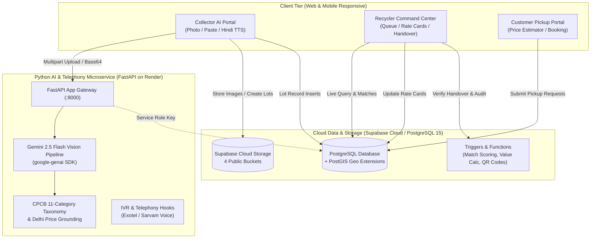
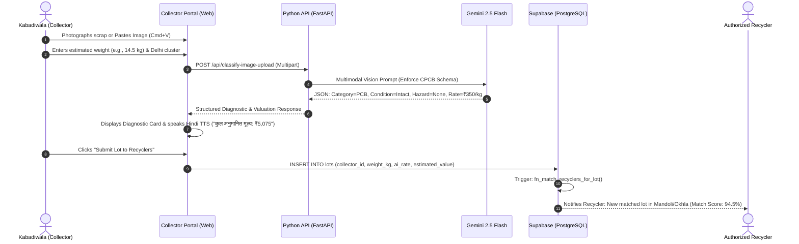
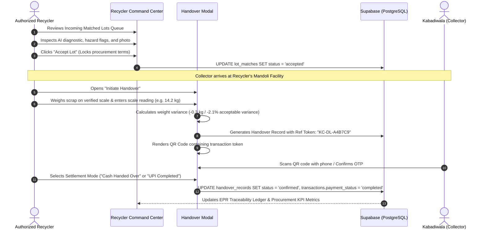
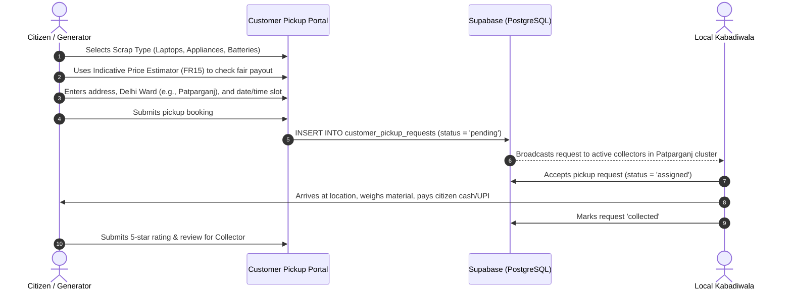
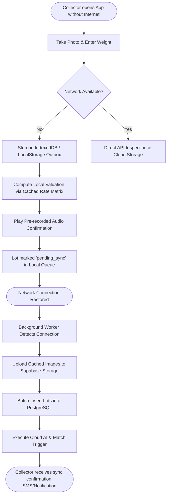
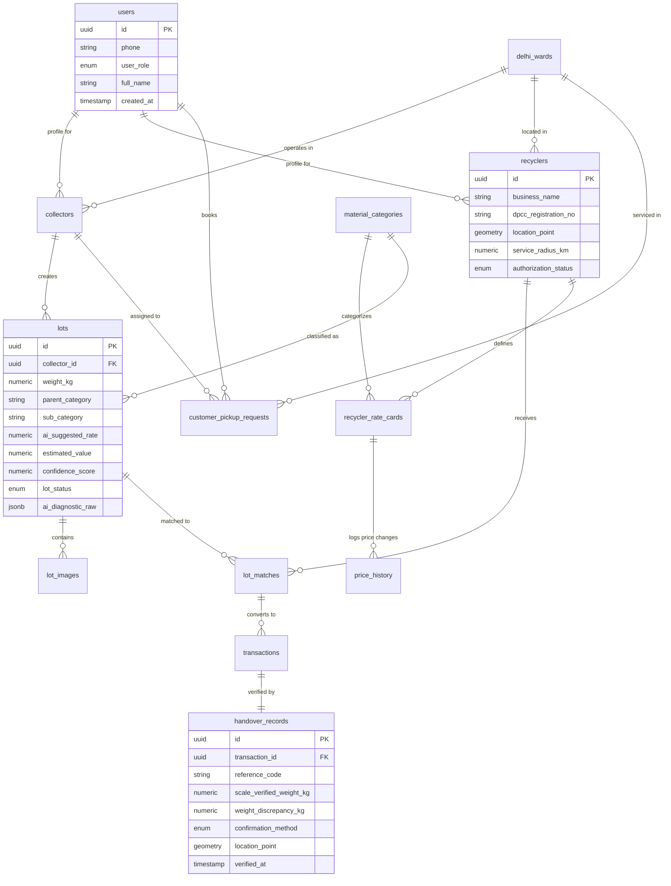

# ScrapSetu (Kabadiwala Connect)
### Bridging Informal E-Waste Collectors into the Formal, Traceable Value Chain

> **Smart India Hackathon 2026** — JNARDDC / Ministry of Mines (Problem Statement ID: **26229**)  
> **Pilot Geography**: National Capital Territory (NCT) of Delhi (Shahdara/Mandoli, Okhla, Patparganj, Peeragarhi, Mohan Cooperative)  
> **Regulatory Alignment**: E-Waste (Management) Rules, 2022 & CPCB/DPCC EPR Guidelines

---

## 📑 Table of Contents

1. [Executive Summary & Problem Statement](#-executive-summary--problem-statement)
2. [Project Scope & Feasibility Matrix (FR1–FR15)](#-project-scope--feasibility-matrix-fr1fr15)
3. [End-to-End System Architecture](#-end-to-end-system-architecture)
4. [Complete Directory & Folder Structure](#-complete-directory--folder-structure)
5. [What Has Been Built Till Now (Current Progress)](#-what-has-been-built-till-now-current-progress)
   - [5.1 Supabase & PostgreSQL Layer](#51-supabase--postgresql-layer)
   - [5.2 Python AI & Vision Engine (`main/api/`)](#52-python-ai--vision-engine-mainapi)
   - [5.3 Next.js 15 Web Platform (`main/web/`)](#53-nextjs-15-web-platform-mainweb)
   - [5.4 Cloud Storage & Type Generation Pipelines](#54-cloud-storage--type-generation-pipelines)
6. [Detailed User & Process Flows](#-detailed-user--process-flows)
   - [User Flow 1: Informal Collector (Kabadiwala AI Inspection & Match)](#user-flow-1-informal-collector-kabadiwala-ai-inspection--match)
   - [User Flow 2: DPCC Authorized Recycler (Procurement & QR Handover)](#user-flow-2-dpcc-authorized-recycler-procurement--qr-handover)
   - [User Flow 3: Household / Bulk Generator Pickup Booking](#user-flow-3-household--bulk-generator-pickup-booking)
   - [User Flow 4: Low-Literacy / Offline Outbox Synchronization](#user-flow-4-low-literacy--offline-outbox-synchronization)
7. [Database Schema & Entity Relationships](#-database-schema--entity-relationships)
8. [What Is Remaining (Roadmap & Next Steps)](#-what-is-remaining-roadmap--next-steps)
9. [Local Setup & Running Instructions](#-local-setup--running-instructions)
10. [Environment Variables Reference](#-environment-variables-reference)

---

## 🌍 Executive Summary & Problem Statement

### The Problem
Over **95% of India's e-waste** is collected by the informal sector—local *kabadiwalas*, waste-pickers, and micro-aggregators. They provide unmatched door-to-door collection reach but operate completely isolated from the formal recycling ecosystem mandated by India's **E-Waste (Management) Rules, 2022**.

Because collectors lack:
1. **Price Transparency**: Middlemen exploit them with arbitrary, depressed rates.
2. **Authorized Market Access**: They have no direct link to State Pollution Control Board (DPCC/CPCB) authorized dismantlers.
3. **Traceable Verification**: Transactions are undocumented, blocking recyclers from claiming Extended Producer Responsibility (**EPR**) credits.

This forces hazardous, high-value materials (Lithium, Cobalt, Neodymium, Tantalum, Gold, Copper) into dangerous backyard operations—such as open cable burning, acid leaching, and manual heating of circuit boards—resulting in severe toxicity, environmental devastation, and loss of critical minerals.

### The Solution: ScrapSetu
**ScrapSetu** provides a multimodal, vernacular, low-literacy platform that transforms informal scrap collectors into recognized, digitized supply chain partners:
- **Multimodal AI Vision Inspection**: Collectors photograph scrap lots or paste images; Google Gemini 2.5 Flash classifies materials against a closed 11-parent CPCB taxonomy, detects hazards, and calculates fair Delhi market valuations instantly.
- **Vernacular Audio Assistance**: Hindi speech synthesis (TTS) reads valuations and safety advisories aloud for low-literacy operators.
- **Deterministic Recycler Matching**: PostGIS geo-scoring pairs scrap lots with authorized recyclers based on distance, accepted categories, and live rate cards.
- **Tamper-Evident Digital Handover**: Verified scale readings, geo-stamping, and unique human-readable QR codes (`KC-DL-XXXXXX`) establish chain-of-custody compliance.

---

## 🎯 Project Scope & Feasibility Matrix (FR1–FR15)

The project scope is categorized according to hackathon prototype feasibility:
- 🟢 **Build**: Fully implemented with real software, live APIs, and database persistence.
- 🟡 **Simulate for Demo**: Working demonstration utilizing realistic pilot datasets and deterministic rules.
- 🔴 **Document as Roadmap**: Long-term production architecture outlined for scale.

| Req ID | Capability / Feature | Status | Prototype Implementation Notes |
|---|---|---|---|
| **FR1** | **Digital Lot Creation** | 🟢 Build | Full photo upload, drag-and-drop, clipboard paste, weight entry, and lot generation. |
| **FR2** | **Price Discovery & Trends** | 🟡 Simulate | 7-day rolling Delhi market averages, min/max spreads, and directional trends. |
| **FR3** | **Material & Transaction Ledger** | 🟢 Build | PostGIS + Supabase tables with comprehensive audit logs and EPR metrics. |
| **FR4** | **Authorized Recycler Directory** | 🟢 Build | Real Delhi DPCC-verified recyclers (Mandoli, Okhla, Patparganj, Peeragarhi). |
| **FR5** | **AI/ML Scrap Classification** | 🟢 Build | Live Gemini 2.5 Flash Multimodal Vision pipeline with structured JSON schema. |
| **FR6** | **Deterministic Recycler Match** | 🟢 Build | Geo-proximity + category matching scoring algorithm (`fn_match_recyclers_for_lot`). |
| **FR7** | **Digital Handover & QR Trace** | 🟢 Build | Verified scale input, discrepancy alerts, unique QR codes, and handover state machine. |
| **FR8** | **Earnings Ledger** | 🟢 Build | Live summary view tracking collector volume, accepted revenue, and settlement status. |
| **FR9** | **Pictorial Safety Guidance** | 🟢 Build | Hindi & Marathi safety directives for Lithium Batteries, CRT Lead, and Cable Burning. |
| **FR10** | **Multilingual Audio (TTS)** | 🟢 Build | Browser Web Speech API reading Hindi numbers and rates aloud; Sarvam AI backend ready. |
| **FR11** | **Offline Outbox Sync** | 🟢 Build | Local browser storage fallback with simulated offline outbox queue and reconnect push. |
| **FR12** | **Payment Tracking** | 🟢 Build | Cash-first vs. UPI transaction records with settlement state tracking. |
| **FR13** | **Customer Pickup Booking** | 🟢 Build | Household & bulk generator portal with ward selection, date scheduling, and status tracking. |
| **FR14** | **Bulk Generator Pool Routing**| 🟡 Simulate | Routing rule logic with collector notification pool and recycler direct fallback. |
| **FR15** | **Customer Fair Price Estimator** | 🟢 Build | Live upfront calculation of scrap value based on weight and device category. |

---

## 🏗 End-to-End System Architecture

ScrapSetu is organized into three decoupled tiers:



---

## 📁 Complete Directory & Folder Structure

```
scrapsetu/
├── .gitignore                                 # Ignores docs/, node_modules/, .env*
├── README.md                                  # Master project reference (this file)
│
├── docs/                                      # Specification & Architecture Documentation
│   ├── Kabadiwala_Connect_PRD.md              # Complete Product Requirements Document
│   ├── Kabadiwala_Connect_Architecture_and_Backend_Plan.md # System architecture & database blueprint
│   ├── all_in_one_quickstart.sql              # Consolidated 1-click database initialization runner
│   ├── supabase_step_by_step_guide.md         # Database migration instructions & best practices
│   ├── project_context_and_progress.md        # Activity log & milestone history
│   ├── session_context_and_activity_dump.md   # Chronological implementation & debugging details
│   └── migrations/                            # 10 Modular Sequential SQL Migrations
│       ├── 01_extensions_and_enums.sql        # PostGIS, pgcrypto, 10 core domain enums
│       ├── 02_geo_and_reference_tables.sql    # Delhi ward polygons, 11 material categories
│       ├── 03_users_and_profiles.sql          # Decoupled users, collectors, authorized recyclers
│       ├── 04_pricing_tables.sql              # Recycler rate cards & append-only price history
│       ├── 05_lots_and_images.sql             # Scrap lots & image attachments
│       ├── 06_transactions_and_handover.sql   # Matches, financial transactions, handover records
│       ├── 07_bookings_and_reviews.sql        # Pickup requests, ratings, voice call logs
│       ├── 08_helpers_views_triggers.sql      # Matching algorithms, valuation triggers, price views
│       ├── 09_seed_data.sql                   # Delhi wards, DPCC recyclers, rates, safety data
│       └── 10_storage_buckets_and_policies.sql# Storage buckets & RLS public access rules
│
└── main/                                      # Application Source Code
    ├── api/                                   # Python AI & Bot Service (FastAPI / Render target)
    │   ├── .env.example                       # Committed environment variables template
    │   ├── .env                               # Local secrets (Gemini API Key, Supabase Keys)
    │   ├── .gitignore                         # API-specific git exclusions
    │   ├── requirements.txt                   # FastAPI, google-genai, supabase, uvicorn
    │   ├── runtime.txt                        # Python runtime specification (python-3.11)
    │   ├── main.py                            # FastAPI application entrypoint & REST endpoints
    │   ├── gemini_service.py                  # Gemini 2.5 Flash multimodal vision inspection
    │   ├── taxonomy_data.py                   # 11 CPCB categories, Delhi pilot rates, hazard definitions
    │   ├── check_models.py                    # Diagnostic script auditing Google GenAI models
    │   └── test_live_vision.py                # Synthetic circuit board image generation & smoke test
    │
    └── web/                                   # Next.js 15 Web Platform (App Router / Vercel target)
        ├── .env.example                       # Committed environment variables template
        ├── .env.local                         # Local web secrets (Supabase credentials)
        ├── .gitignore                         # Next.js git exclusions
        ├── package.json                       # Next.js 15, React 19, TypeScript, Lucide icons
        ├── tsconfig.json                      # Strict TypeScript compilation rules
        ├── next.config.ts                     # Next.js runtime configuration
        ├── eslint.config.mjs                  # Linter rules
        │
        ├── app/                               # Next.js App Router
        │   ├── layout.tsx                     # Root HTML shell, ambient background, global metadata
        │   ├── page.tsx                       # Central dashboard coordinator & state manager
        │   └── globals.css                    # 600+ lines Vanilla CSS dark glassmorphism design system
        │
        ├── components/                        # Modular Frontend Views & Components
        │   ├── CollectorPortal.tsx            # Kabadiwala AI photo scanner, paste, Hindi TTS, outbox
        │   ├── RecyclerOverview.tsx           # Recycler Command Center KPIs, charts, quick actions
        │   ├── MatchedLotsQueue.tsx           # Filterable incoming e-waste lot queue with match scores
        │   ├── HandoverVerificationModal.tsx  # Scale verification modal, discrepancy calculation, QR
        │   ├── HandoverTraceabilityView.tsx   # Immutable audit log for completed handovers
        │   ├── RateCardManager.tsx            # Recycler procurement price list editor (₹/kg)
        │   ├── CustomerPickupPortal.tsx       # Household/Bulk generator booking with price estimator
        │   ├── LivePriceBoard.tsx             # Delhi 7-day rolling market rates with Hindi TTS
        │   ├── SafetyGuidanceView.tsx         # Hindi & Marathi pictorial safety guides for hazardous e-waste
        │   ├── Header.tsx                     # Top navigation, cluster indicator, role switcher
        │   └── Sidebar.tsx                    # Side navigation menu with active badges and status dot
        │
        ├── lib/                               # Utilities & Infrastructure Clients
        │   ├── supabase.ts                    # Isomorphic Supabase client with sandbox fallback
        │   └── mock-data.ts                   # Delhi pilot verified mock dataset
        │
        ├── types/                             # TypeScript Type Definitions
        │   └── database.ts                    # Auto-generated Supabase schema + domain helper interfaces
        │
        └── scripts/                           # Automation & Maintenance Utilities
            ├── generate-types.sh              # High-speed (<500ms) PostgREST TypeScript generator
            └── setup-storage-buckets.js       # Cloud storage bucket initializer script
```

---

## ⚡ What Has Been Built Till Now (Current Progress)

### 5.1 Supabase & PostgreSQL Layer
- **PostGIS Geo-Spatial Engine**: Enables spatial distance calculations between scrap collectors and recycling facilities across 5 Delhi pilot clusters.
- **10 Modular Migrations**:
  - Normalized schema supporting `users`, `collectors`, `recyclers`, `lots`, `lot_matches`, `transactions`, `handover_records`, `customer_pickup_requests`, and `price_history`.
  - Stored Procedure `fn_match_recyclers_for_lot`: Computes deterministic composite match score based on geographic proximity (40%), material acceptance (30%), and offered rate relative to benchmark (30%).
  - Trigger `fn_calculate_lot_estimated_value`: Automatically computes `estimated_value = weight_kg * rate_per_kg`.
  - Function `fn_generate_handover_ref_code`: Generates tamper-evident human-readable tokens (`KC-DL-XXXXXX`).
- **Auth Schema Decoupling**: Decoupled `public.users.id` from `auth.users` using `UUID PRIMARY KEY DEFAULT gen_random_uuid()`. This allows zero-friction development and phone/IVR users without Supabase Auth permission errors.
- **Live Deployment**: Deployed on Supabase project `nyohejyiqiccttaobhjd.supabase.co`.

### 5.2 Python AI & Vision Engine (`main/api/`)
- **Gemini 2.5 Flash Vision Pipeline** ([`gemini_service.py`](file:///Users/prakharrr/scrapsetu/main/api/gemini_service.py)):
  - Uses the official `google-genai` SDK with strict JSON schema enforcement.
  - Returns: Primary Category, Sub-Category, Physical Condition, Hazard Flags, Visual Components, Confidence Score, Estimated Market Value, and CPCB Schedule I EPR Reference.
- **Closed 11-Parent Taxonomy Grounding** ([`taxonomy_data.py`](file:///Users/prakharrr/scrapsetu/main/api/taxonomy_data.py)):
  - Covers `PCB`, `BATTERY`, `CRT`, `LCD_LED_PANEL`, `CABLE_WIRE`, `MOTOR_MAGNET`, `METAL_SCRAP`, `PLASTIC`, `WHOLE_DEVICE`, `LIGHTING`, `MISC_COMPONENT`.
  - Enforces official Delhi benchmark pricing (Min / Average / Max ₹/kg).
- **FastAPI Endpoints**:
  - `GET /health` — Service readiness check.
  - `GET /api/taxonomy` — Full taxonomy metadata and pricing tables.
  - `POST /api/classify-lot` — Base64 payload inspection.
  - `POST /api/classify-image-upload` — Interactive file-upload inspection for Swagger UI testing at `/docs`.
  - `POST /api/test-sample` — 1-click synthetic testing with pre-baked material profiles.

### 5.3 Next.js 15 Web Platform (`main/web/`)
- **Dark Glassmorphism Design System** ([`globals.css`](file:///Users/prakharrr/scrapsetu/main/web/app/globals.css)):
  - Custom CSS tokens, fluid typography (`Outfit` and `Plus Jakarta Sans`), responsive grid layouts, animated status indicators, and glass containers.
- **Role Quick Switcher** ([`Header.tsx`](file:///Users/prakharrr/scrapsetu/main/web/components/Header.tsx)):
  - 1-click toggling between `[ 📦 Recycler View ]` and `[ ⚡ Collector AI Scanner ]`.
- **Collector Portal (`CollectorPortal.tsx`)**:
  - Multi-input image ingestion: File upload, camera capture, drag-and-drop, and direct OS clipboard pasting (`Cmd+V` / `Ctrl+V`).
  - Real-time Gemini 2.5 Flash AI inspection trigger.
  - Web Speech API Hindi audio readout (`बोलकर सुनें`) for low-literacy collectors.
  - Immediate lot creation wiring directly into the Recycler's incoming matching queue.
  - Local browser storage queue simulating offline lot creation with sync recovery.
- **Recycler Command Center (`RecyclerOverview.tsx`)**:
  - Key performance indicators: Procured volume (kg), incoming matches awaiting review, estimated valuation, DPCC compliance rating.
  - Interactive candidate lot table with 1-click inspection.
- **Matched Lots Queue (`MatchedLotsQueue.tsx`)**:
  - Comprehensive lot details showing AI confidence, hazard tags, weight, and proximity score.
  - Acceptance flow triggering the physical handover protocol.
- **Digital Handover & QR Traceability (`HandoverVerificationModal.tsx` & `HandoverTraceabilityView.tsx`)**:
  - Scale input with automated variance calculation against the collector's declared weight.
  - Live SVG QR Code generation for physical counter-party scanning.
  - Handover confirmation method selection (`app_tap`, `otp`, `qr_scan`).
  - Immutable audit trail view displaying completed handovers.
- **Customer Pickup Portal (`CustomerPickupPortal.tsx`)**:
  - Household vs. Bulk generator toggle.
  - **Indicative Price Estimator (FR15)** calculating fair value before booking.
  - Ward selector and pickup schedule tracker with status lifecycle badges.
- **Live Price Board (`LivePriceBoard.tsx`)**:
  - Transparent 7-day rolling prices per kg with Hindi speech synthesis.
- **Safety Guidance Hub (`SafetyGuidanceView.tsx`)**:
  - Bilingual (Hindi & Marathi) pictorial safety advisories for hazardous components.

### 5.4 Cloud Storage & Type Generation Pipelines
- **4 Supabase Storage Buckets Initialized**:
  - `lot-images` (Collector scrap photos)
  - `handover-photos` (Scale readings & delivery proof)
  - `pickup-photos` (Customer booking photos)
  - `safety-media` (Pictorial guide assets)
- **High-Speed Type Generation Pipeline** ([`scripts/generate-types.sh`](file:///Users/prakharrr/scrapsetu/main/web/scripts/generate-types.sh)):
  - Uses `openapi-typescript` against the PostgREST OpenAPI HTTPS schema.
  - Generates 3,440 lines of strictly typed schema in **<500ms** with zero Docker requirement and zero IPv6 connection issues.
  - Executable via `npm run update-types`.

---

## 🔄 Detailed User & Process Flows

### User Flow 1: Informal Collector (Kabadiwala AI Inspection & Match)



### User Flow 2: DPCC Authorized Recycler (Procurement & QR Handover)



### User Flow 3: Household / Bulk Generator Pickup Booking



### User Flow 4: Low-Literacy / Offline Outbox Synchronization



---

## 🗄 Database Schema & Entity Relationships



---

## 🚀 What Is Remaining (Roadmap & Next Steps)

The following items represent the planned roadmap to transition the prototype into a production platform:

### 1. Telephony & Voice IVR Webhooks (`main/api/`)
- **Exotel Integration**: Implement inbound phone line answering calls from non-smartphone collectors.
- **Sarvam AI Audio Stack**:
  - **Saarika STT**: Speech-to-text transcribing spoken Hindi/Bhojpuri scrap descriptions.
  - **Bulbul v3 TTS**: Natural vernacular speech synthesis reading live market prices over IVR audio streams.

### 2. WhatsApp Business Bot Channel
- **Meta Cloud API Webhook**: Connect WhatsApp bot allowing collectors to submit a scrap photo directly via WhatsApp chat and receive an automated Gemini diagnostic reply.

### 3. Real-Time Frontend Subscriptions
- Replace client polling in Next.js with **Supabase Realtime WebSockets** (`supabase.channel('lot_matches')`) so recyclers see incoming matched lots instantly without page refresh.

### 4. Official EPR Compliance & CPCB Export
- Export formal **Digital Handover Certificates** matching CPCB Form 6 / Schedule I audit standards with digital signatures for verified recyclers.

### 5. Production Cloud Deployment
- **Web App**: Deploy Next.js App to **Vercel** with custom domain.
- **Python Service**: Deploy FastAPI container to **Render** or **Google Cloud Run**.
- **Supabase Cloud**: Run production migration checks and activate point-in-time recovery (PITR).

---

## 💻 Local Setup & Running Instructions

### Prerequisites
- **Node.js**: v18.18+ or v20+
- **Python**: v3.11+
- **npm**: v9+
- **Git**

### 1. Clone the Repository
```bash
git clone https://github.com/nikhillakra2007-tech/scrapsetu.git
cd scrapsetu
```

### 2. Set Up the Python AI Service (`main/api/`)
```bash
cd main/api
python3 -m venv venv
source venv/bin/activate
pip install -r requirements.txt

# Verify environment variables
cp .env.example .env
# Edit .env and supply your GEMINI_API_KEY and SUPABASE keys

# Audit available Gemini models
python check_models.py

# Start the FastAPI server (Runs on port 8000)
uvicorn main:app --host 127.0.0.1 --port 8000 --reload
```
Interactive Swagger documentation will be available at [http://127.0.0.1:8000/docs](http://127.0.0.1:8000/docs).

### 3. Set Up the Next.js Web Platform (`main/web/`)
In a new terminal window:
```bash
cd main/web
npm install

# Verify environment variables
cp .env.example .env.local
# Edit .env.local and supply your Supabase URL & Anon Key

# Optional: Refresh database TypeScript types directly from Supabase
npm run update-types

# Start the Next.js development server (Runs on port 3000)
npm run dev
```
Open [http://localhost:3000](http://localhost:3000) in your browser.

### 4. Validate Production Build
To ensure code correctness and zero compilation or lint errors:
```bash
cd main/web
npm run build
```

---

## 🔑 Environment Variables Reference

### Web Application (`main/web/.env.local`)
| Variable | Description |
|---|---|
| `NEXT_PUBLIC_SUPABASE_URL` | Cloud Supabase Project URL (`https://[PROJECT-ID].supabase.co`) |
| `NEXT_PUBLIC_SUPABASE_ANON_KEY` | Public anonymous API key for browser client queries |
| `SUPABASE_SERVICE_ROLE_KEY` | Elevated key for server-side scripts and type generation |
| `NEXT_PUBLIC_API_URL` | URL of the Python AI microservice (Default: `http://localhost:8000`) |
| `NEXT_PUBLIC_APP_URL` | Base URL of the web application (Default: `http://localhost:3000`) |

### Python AI Microservice (`main/api/.env`)
| Variable | Description |
|---|---|
| `PORT` | API server port (Default: `8000`) |
| `GEMINI_API_KEY` | Google AI Studio API key for Gemini 2.5 Flash |
| `GEMINI_MODEL` | Targeted model name (`gemini-2.5-flash`) |
| `SUPABASE_URL` | Cloud Supabase Project URL |
| `SUPABASE_SERVICE_ROLE_KEY` | Supabase Service Role key for database operations |
| `SARVAM_API_KEY` | API Key for Sarvam vernacular speech processing (Roadmap) |
| `EXOTEL_ACCOUNT_SID` | Telephony account identifier (Roadmap) |
| `WHATSAPP_API_TOKEN` | Meta WhatsApp Cloud API bearer token (Roadmap) |

---

## ⚖️ License & Attribution
Developed for **Smart India Hackathon 2026** under Problem Statement **26229** (Ministry of Mines / JNARDDC).  
Built to empower India's informal waste collectors and accelerate formal, sustainable circular economy practices.
