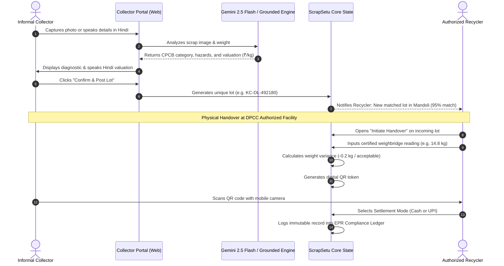

# ScrapSetu (Kabadiwala Connect)
### Bridging Informal E-Waste Collectors into the Formal, Traceable Value Chain

> **Smart India Hackathon** — JNARDDC / Ministry of Mines (Problem Statement ID: **26229**)  
> **Pilot Geography**: National Capital Territory (NCT) of Delhi (*Mandoli/Shahdara, Okhla, Patparganj, Peeragarhi, Mohan Cooperative*)  
> **Regulatory Alignment**: E-Waste (Management) Rules, 2022 & CPCB/DPCC EPR Guidelines  
> **Design Theme**: LeafLine Soothing Ivory & Deep Pine Sustainability Palette

---

## 📑 Table of Contents

1. [Executive Summary & Problem Statement](#-executive-summary--problem-statement)
2. [Dual-Persona System Architecture](#-dual-persona-system-architecture)
   - [2.1 Informal Collector Portal](#21-informal-collector-portal)
   - [2.2 DPCC Authorized Recycler Command Center](#22-dpcc-authorized-recycler-command-center)
   - [2.3 Setu Delhi Civic Assistant](#23-setu-delhi-civic-assistant)
3. [AI Classification & Multimodal Vision Models](#-ai-classification--multimodal-vision-models)
   - [3.1 Google Gemini 2.5 Flash Multimodal Vision](#31-google-gemini-25-flash-multimodal-vision)
   - [3.2 Grounded Delhi Material Classification Engine](#32-grounded-delhi-material-classification-engine)
   - [3.3 2-Way Vernacular Voice Assistant (Hindi STT & TTS)](#33-2-way-vernacular-voice-assistant-hindi-stt--tts)
4. [Design System & UI Experience](#-design-system--ui-experience)
   - [4.1 LeafLine Organic Color Palette](#41-leafline-organic-color-palette)
   - [4.2 Physical Sliding Role Switch (Recycle Icon)](#42-physical-sliding-role-switch-recycle-icon)
   - [4.3 Cascading Drop Intro Animations & Smooth Transitions](#43-cascading-drop-intro-animations--smooth-transitions)
5. [Complete Repository & Folder Structure](#-complete-repository--folder-structure)
6. [Detailed User & Data Flows](#-detailed-user--data-flows)
7. [Database Schema & PostGIS Geo-Matching](#-database-schema--postgis-geo-matching)
8. [Local Setup & Running Instructions](#-local-setup--running-instructions)
9. [Environment Variables Reference](#-environment-variables-reference)
10. [Roadmap & Scale Vision](#-roadmap--scale-vision)

---

## 🌍 Executive Summary & Problem Statement

### The Problem
Over **95% of India's e-waste** is collected by the informal sector—local *kabadiwalas*, waste-pickers, and micro-aggregators. While they have unparalleled doorstep collection reach across Indian cities, they operate completely disconnected from the formal recycling ecosystem mandated by India's **E-Waste (Management) Rules, 2022**:

1. **Price Exploitation**: Middlemen depress scrap rates arbitrarily without market transparency.
2. **Hazardous Backyard Processing**: Lacking formal dockets, informal aggregators engage in acid-leaching, open cable burning, and circuit board heating to extract copper and precious metals, causing catastrophic pollution and mineral loss.
3. **Broken EPR Compliance**: Transactions remain undocumented, preventing formal dismantlers from claiming Extended Producer Responsibility (**EPR**) credits.

### The Solution: ScrapSetu
**ScrapSetu** bridges this gap by turning informal scrap collectors into recognized, digitized supply chain partners:
- **Multimodal AI Vision**: Instant CPCB 11-category scrap classification, physical condition evaluation, hazard flagging, and fair Delhi benchmark valuation.
- **Role-Segregated Workspaces**: Dedicated, clutter-free interfaces for collectors and recyclers with a single physical toggle switch.
- **Vernacular Audio Assistance**: 2-way Hindi Speech Recognition (`STT`) and Voice Readout (`TTS`) designed for low-literacy operators.
- **Deterministic Recycler Matching**: Pairs scrap lots with authorized dismantlers based on PostGIS geographic proximity, material acceptance, and rate cards.
- **Tamper-Evident QR Traceability**: Certified weighbridge recordings, discrepancy checks, and unique human-readable transaction tokens (`KC-DL-XXXXXX`) establish full chain-of-custody compliance.

---

## 👥 Dual-Persona System Architecture

Instead of cluttering users with an overwhelming 8-tab navigation, ScrapSetu segregates capabilities strictly by role:

```
                             ┌──────────────────────────────┐
                             │    ScrapSetu Platform        │
                             │  (Physical Switch: Recycle)  │
                             └──────────────┬───────────────┘
                                            │
                     ┌──────────────────────┴──────────────────────┐
                     ▼                                             ▼
          [ COLLECTOR APP ]                             [ RECYCLER PORTAL ]
   ⚡ AI Scrap Scanner & Scale                     📊 Facility Command Hub
   📈 Live Price Board (Delhi Rates)              📥 Incoming Matched Lots Queue
   ⚠️ Pictorial Worker Safety                     🛡️ Handover & QR Scale Verification
   🚚 Citizen Doorstep Pickups                    💳 Rate Card Manager (₹/kg)
```

### 2.1 Informal Collector Portal
- **AI Scrap Scanner** ([`CollectorPortal.tsx`](file:///main/web/features/collector/CollectorPortal.tsx)): Camera photo capture, image drag-and-drop, clipboard paste (`Ctrl+V`), and sample presets. Real-time Gemini 2.5 Flash classification.
- **Physical Scale Input**: Enter lot weight in kilograms with instant value calculation.
- **Category Quick Override Pills**: Instant one-tap inspection across PCB, Battery, Cable, CRT, Display, Motor, Metal Scrap, and Whole Devices.
- **Live Price Board** ([`LivePriceBoard.tsx`](file:///main/web/features/price-board/LivePriceBoard.tsx)): 7-day rolling Delhi market benchmarks with high/low spreads and Hindi audio readouts.
- **Worker Safety Guides** ([`SafetyGuidanceView.tsx`](file:///main/web/features/safety/SafetyGuidanceView.tsx)): Bilingual (Hindi & English) pictorial hazard directives for handling swollen lithium-ion cells, leaded CRT glass, and open wiring.
- **Citizen Pickups** ([`CustomerPickupPortal.tsx`](file:///main/web/features/customer-pickup/CustomerPickupPortal.tsx)): Household and bulk generator collection requests broadcasted across Delhi wards.

### 2.2 DPCC Authorized Recycler Command Center
- **Command Hub** ([`RecyclerOverview.tsx`](file:///main/web/features/recycler/RecyclerOverview.tsx)): Daily procurement KPIs, incoming candidate lots, and DPCC EPR compliance status.
- **Incoming Lots Queue** ([`MatchedLotsQueue.tsx`](file:///main/web/features/recycler/MatchedLotsQueue.tsx)): Review offered scrap lots, AI confidence, hazard flags, and geographic proximity score before accepting.
- **Handover & QR Scale Verification** ([`HandoverVerificationModal.tsx`](file:///main/web/features/handover/HandoverVerificationModal.tsx) & [`HandoverTraceabilityView.tsx`](file:///main/web/features/handover/HandoverTraceabilityView.tsx)): Weighbridge verification, variance calculation against declared weight, unique digital QR code generation, and immutable audit ledger.
- **Rate Card Manager** ([`RateCardManager.tsx`](file:///main/web/features/recycler/RateCardManager.tsx)): Live configuration of procurement pricing per kg across all CPCB material categories.

### 2.3 Setu Delhi Civic Assistant
- **Floating Civic Support** ([`SetuAssistant.tsx`](file:///main/web/components/SetuAssistant.tsx)): Bottom-right floating assistant with isolated scrolling (`overscroll-behavior: contain`) preventing page interference. Answers citizen and collector inquiries regarding Delhi e-waste rates, doorstep pickup bookings, and hazardous material safety.

---

## 🤖 AI Classification & Multimodal Vision Models

ScrapSetu features a dual-engine architecture to guarantee reliable, instantaneous, and deterministic scrap classification in any environment:

```
                            [ Scrap Image Input ]
                                      │
                 ┌────────────────────┴────────────────────┐
                 ▼                                         ▼
   [ Live Google Gemini 2.5 Flash ]          [ Grounded Delhi Pilot Engine ]
   • Direct REST Call / API Key              • Canvas Color & Luminance Sampler
   • Strict CPCB Taxonomy JSON               • Delhi 7-Day Rolling Benchmark Matrix
   • Component Identification                • Scale-Weighted Payout Calculation
                 │                                         │
                 └────────────────────┬────────────────────┘
                                      ▼
                        [ Structured Classification ]
                        • CPCB Category & Sub-Code
                        • Physical Condition (Intact / Scrap)
                        • Hazard Flags (Lithium / Leaded / Acid)
                        • Suggested Rate (₹/kg) & Lot Valuation
```

### 3.1 Google Gemini 2.5 Flash Multimodal Vision
- **Live Google API Drawer**: Collectors and evaluators can connect their Google Gemini API key directly in the web UI.
- **Structured Schema**: Calls Gemini 2.5 Flash with structured JSON output enforcing CPCB 11-parent taxonomy:
  - `parent_code`, `sub_code`, `condition`, `category_confidence`, `hazard_flags`, `is_hazardous`, `suggested_rate_per_kg`, `identified_components`, and `ai_notes`.
- **Python Microservice** ([`main/api/gemini_service.py`](file:///main/api/gemini_service.py)): FastAPI endpoint `/api/classify-image-upload` providing backend verification for high-throughput batch classification.

### 3.2 Grounded Delhi Material Classification Engine
- **Zero-Dependency Fallback**: If an API key is not entered or if the network is offline, the grounded Delhi engine automatically activates.
- **Canvas Pixel Color Sampling**: Analyzes image luminance and dominant color spectrum on a 32×32 canvas (e.g., green PCB detection, copper red cable identification, dark lithium-ion casing detection).
- **CPCB Category Profiles**: High-affinity matching across 8 core e-waste types with dynamic confidence and live Delhi benchmark rates.

### 3.3 2-Way Vernacular Voice Assistant (Hindi STT & TTS)
- **Hindi Speech Recognition (`STT`)**: Collectors tap the microphone button (`बोलकर बताएं 🎙️`) and describe scrap in Hindi or Hinglish (e.g., *"10 kilo copper wire Okhla"* or *"पंद्रह किलो तांबा"*). The engine transcribes speech, extracts material category, weight, and Delhi ward, and triggers inspection automatically.
- **Hindi Speech Synthesis (`TTS`)**: Tapping the speaker button (`बोलकर सुनें 🔊`) reads out the classified material and total fair payout in clear Hindi audio.

---

## 🎨 Design System & UI Experience

### 4.1 LeafLine Organic Color Palette
Inspired by the calm, grounded aesthetic of [LeafLine Ivory](https://leaf-line-ivory.vercel.app/), ScrapSetu eliminates bright white glare and eye strain:
- **Canvas Background**: Warm Leaf Ivory (`#FAF8EE`)
- **Primary Brand Color**: Deep Pine / Bangladesh Green (`#005F52`)
- **Accent Indicator**: Caribbean Emerald (`#1CC596`)
- **Surfaces**: Crisp White Cards (`#FFFFFF`) with organic borders (`#E2DDD0`)
- **Typography**: Rich Dark Charcoal (`#020F12`) for headers, Eucalyptus Sage (`#3D5A47`) for body copy

### 4.2 Physical Sliding Role Switch (Recycle Icon)
Modeled as a physical sliding toggle pill in the top header:
- **States**: Displays **`RECYCLER`** ↔ **`COLLECTOR`**
- **Iconography**: Houses a bold, heavy-weight **Recycle symbol** (`strokeWidth={2.6}`) with a 45° rotation micro-interaction on hover.
- **Single-Click Workflow**: Instantly switches the entire application layout, loaded tools, and active context.

### 4.3 Cascading Drop Intro Animations & Smooth Transitions
- **Cascading Drop-In**: Page segments drop into place sequentially on load:
  - `drop-segment-1` (0.08s delay): Header, brand wordmark, and role subtitle.
  - `drop-segment-2` (0.25s delay): KPI grid and quick category pills.
  - `drop-segment-3` (0.45s delay): Procurement action banner and photo dropzone.
  - `drop-segment-4` (0.65s delay): Candidate lots table and AI valuation card.
- **1-Second Smooth Transitions**: Navigating between sections triggers a 0.95s transition (`section-transition-active`) with smooth deceleration.
- **Inertial Smooth Scrolling**: Powered by [Lenis](https://github.com/darkroomengineering/lenis) for fluid, weighted momentum.

---

## 📁 Complete Repository & Folder Structure

```
scrapsetu/
├── README.md                                  # Comprehensive Master Documentation (This file)
└── main/                                      # Application Root
    ├── api/                                   # Python AI Microservice (FastAPI)
    │   ├── requirements.txt                   # FastAPI, google-genai, supabase, uvicorn
    │   ├── main.py                            # FastAPI entrypoint & classification endpoints
    │   ├── gemini_service.py                  # Gemini 2.5 Flash multimodal vision pipeline
    │   ├── taxonomy_data.py                   # 11 CPCB categories & Delhi pilot rate benchmarks
    │   ├── check_models.py                    # Script auditing active Google GenAI models
    │   └── test_live_vision.py                # Synthetic testing pipeline
    │
    └── web/                                   # Next.js 15 Web Platform (App Router)
        ├── package.json                       # Next.js 15, React 19, TypeScript, Lucide, Lenis
        ├── next.config.ts                     # Next.js configuration
        ├── tsconfig.json                      # Strict TypeScript compiler options
        │
        ├── app/                               # Next.js App Router
        │   ├── layout.tsx                     # Root shell & SEO metadata
        │   ├── page.tsx                       # Role-segregated coordinator & state manager
        │   └── globals.css                    # LeafLine design tokens & drop-in keyframes
        │
        ├── components/                        # Core Shared Shell & Components
        │   ├── SmoothScroll.tsx               # Lenis inertial scrolling wrapper
        │   ├── SetuAssistant.tsx              # Floating civic chat assistant with isolated scroll
        │   ├── SetuAssistant.module.css       # Assistant styling & overscroll containment
        │   ├── shell/                         # Application Header & Navigation
        │   │   ├── Header.tsx                 # Wordmark, role navigation, Recycle toggle switch
        │   │   ├── Header.module.css          # Top bar & physical toggle styling
        │   │   ├── Sidebar.tsx                # Alternative layout sidebar
        │   │   └── Sidebar.module.css
        │   └── ui/                            # Reusable UI Primitives
        │       ├── Badge.tsx & .module.css
        │       ├── Button.tsx & .module.css
        │       ├── Card.tsx & .module.css
        │       └── Modal.tsx & .module.css
        │
        ├── features/                          # Feature-First Architecture
        │   ├── collector/                     # Collector Feature Module
        │   │   ├── CollectorPortal.tsx        # Camera upload, Hindi voice STT, Gemini caller
        │   │   ├── Collector.module.css       # High-contrast LeafLine styling
        │   │   ├── ImageUploader.tsx          # Dropzone, presets, and clipboard paste
        │   │   ├── AiInspectionCard.tsx       # AI diagnostic readout & audio TTS button
        │   │   ├── WeightInput.tsx            # Physical scale weight entry
        │   │   └── LocationSelector.tsx       # Delhi industrial cluster selector
        │   │
        │   ├── recycler/                      # Recycler Feature Module
        │   │   ├── RecyclerOverview.tsx       # Facility dashboard & procurement KPIs
        │   │   ├── Recycler.module.css        # Pine and emerald card styling
        │   │   ├── MatchedLotsQueue.tsx       # Incoming lots filter & acceptance queue
        │   │   └── RateCardManager.tsx        # Procurement rate list manager (₹/kg)
        │   │
        │   ├── handover/                      # Handover & QR Traceability Module
        │   │   ├── HandoverVerificationModal.tsx # Scale verification & QR generator
        │   │   ├── HandoverTraceabilityView.tsx  # Immutable audit ledger
        │   │   └── Handover.module.css
        │   │
        │   ├── price-board/                   # Delhi Price Board Module
        │   │   ├── LivePriceBoard.tsx         # 7-day rolling benchmarks & Hindi TTS
        │   │   └── PriceBoard.module.css
        │   │
        │   ├── safety/                        # Worker Safety Guidance Module
        │   │   ├── SafetyGuidanceView.tsx     # Pictorial safety guides (Lithium, CRT, Cables)
        │   │   └── Safety.module.css
        │   │
        │   └── customer-pickup/               # Citizen Doorstep Pickups Module
        │       ├── CustomerPickupPortal.tsx   # Household/Bulk generator booking & estimator
        │       └── CustomerPickup.module.css
        │
        ├── lib/                               # Infrastructure Clients & Mock Data
        │   ├── supabase.ts                    # Supabase client with sandbox fallback
        │   └── mock-data.ts                   # Delhi pilot verified mock dataset
        │
        └── types/                             # TypeScript Definitions
            └── database.ts                    # Strongly-typed database & domain interfaces
```

---

## 🔄 Detailed User & Data Flows

### Collector to Recycler End-to-End Workflow



---

## 🗄 Database Schema & PostGIS Geo-Matching

- **`lots`**: Stores collector-submitted scrap lots, declared weight, AI suggested rate, estimated value, hazard tags, and status (`draft`, `matched`, `accepted`, `delivered`).
- **`lot_matches`**: Pairs lots with recyclers using a composite score calculated from:
  $$\text{Match Score} = (0.40 \times \text{Geo Proximity}) + (0.30 \times \text{Category Match}) + (0.30 \times \text{Price Spread})$$
- **`handover_records`**: Captures certified scale weights, discrepancies, human-readable reference tokens (`KC-DL-XXXXXX`), and timestamped chain-of-custody.
- **`recycler_rate_cards`**: Recycler-configured procurement price per kg across all 11 CPCB categories.
- **`customer_pickup_requests`**: Doorstep bookings with fair price estimation and Delhi ward routing.

---

## 💻 Local Setup & Running Instructions

### Prerequisites
- **Node.js**: v18.18+ or v20+
- **Python**: v3.11+ (Optional, for running Python FastAPI service)
- **Git**

### 1. Clone & Switch to the Frontend Branch
```bash
git clone https://github.com/nikhillakra2007-tech/scrapsetu.git
cd scrapsetu
git checkout frontend
```

### 2. Run the Next.js Web Application
```bash
cd main/web
npm install

# Start development server
npm run dev

# Or build and start production server
npm run build
npm run start -- -p 3000
```
Open [http://localhost:3000](http://localhost:3000) in your browser.

### 3. (Optional) Run the Python AI Microservice
In a separate terminal window:
```bash
cd main/api
python -m venv venv
source venv/bin/activate  # On Windows: .\venv\Scripts\activate
pip install -r requirements.txt

# Copy environment variables and insert your Google Gemini API key
cp .env.example .env

# Start FastAPI server
uvicorn main:app --host 127.0.0.1 --port 8000 --reload
```
Interactive API documentation will be available at [http://127.0.0.1:8000/docs](http://127.0.0.1:8000/docs).

---

## 🔑 Environment Variables Reference

### Web Platform (`main/web/.env.local`)
| Variable | Description |
|---|---|
| `NEXT_PUBLIC_SUPABASE_URL` | Cloud Supabase Project URL (`https://[PROJECT-ID].supabase.co`) |
| `NEXT_PUBLIC_SUPABASE_ANON_KEY` | Public anonymous API key for client-side queries |
| `NEXT_PUBLIC_API_URL` | URL of the Python AI microservice (Default: `http://localhost:8000`) |
| `NEXT_PUBLIC_APP_URL` | Base URL of the web platform (Default: `http://localhost:3000`) |

### Python AI Microservice (`main/api/.env`)
| Variable | Description |
|---|---|
| `GEMINI_API_KEY` | Google AI Studio API key for Gemini 2.5 Flash |
| `GEMINI_MODEL` | Targeted model name (`gemini-2.5-flash`) |
| `PORT` | API server port (Default: `8000`) |

---

## 🚀 Roadmap & Scale Vision

1. **WhatsApp Cloud Bot Webhook**: Connect WhatsApp Business API allowing informal collectors to snap scrap pictures on basic WhatsApp and receive instant Hindi valuation voice notes.
2. **Sarvam AI Vernacular Voice Stack**: Deep integration with Sarvam Saarika (STT) and Bulbul v3 (TTS) for regional dialects (Bhojpuri, Maithili, Haryanvi).
3. **Formal EPR Certificate Export**: One-click generation of CPCB Form-6 compliant digital manifests for formal dismantlers.

---

## ⚖️ License & Attribution
Developed for **Smart India Hackathon** under Problem Statement **26229** (Ministry of Mines / JNARDDC).  
Built to empower India's informal waste collectors and accelerate formal, sustainable circular economy practices.
